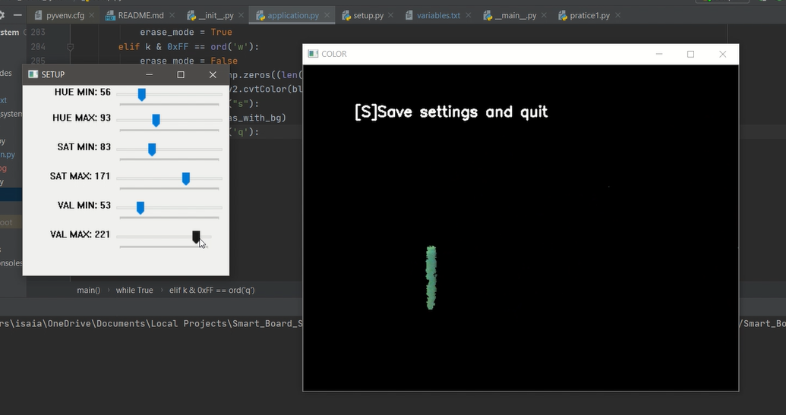

# SMART ELECTRONIC BOARD SYSTEM USING OPEN CV

The Machine vision smart electronic board is an application for people who 
want to draw diagrams, write figures, or create artworks using an object they have and 
a webcam

##How to use
###Before going straight into the program
1. Download a python IDE (Pycharm is reccommended)
2. Clone this project
3. Run Set up
###Running setup 

1. Choose an object
2. Move the HUE MIN trackbar to the left until the object is starting to have black spots. When this happens, move the the trackbar to the left until the object is seen again.  

3. Do the opposite for hue HUE MAX
4. Do steps 2 and 3 for VAL and SAT

5. Press S to save
###Running the Smart  Board
Running the smart board is simple. Just execute application.py and you can now write them down. There are different modes
* press [w]: write mode, lets the user draw on the screen
* press [e]: lets the user erase the drawing on the screen
* press [s]: saves a jpeg image of your drawing
* press [q]: quit

